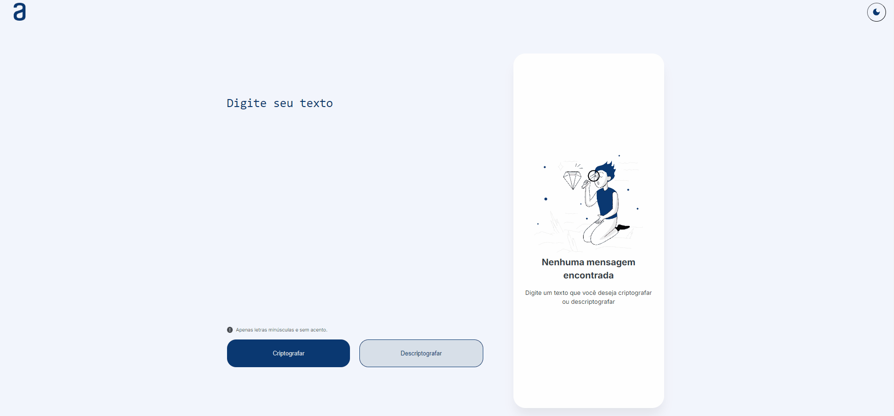

# Challenge ProgramaONE - DECODIFICADOR DE TEXTO

> Decodificador de texto ProgramaONE - Alura + Oracle

# PROJETO: Decodificador de texto

Objetivo desse projeto é a criptografia de textos, onde poderá ser feita troar de mensagens secretas entre pessoas.

    

# Funcionalidades do projeto

O projeto DECODIFICADOR conta com 3 botões e 2 areas de textos. Inicialmente será visível apenas 1 área de texto e 2 botões com duas funcionalidades: 
    - `Criptografar`: Criptografa o texto inserido na área de texto.
    - `Descriptografar`: Descriptografa o texto inserido na área de texto.
Após o texto ser *criptografado*, uma nova área de texto será adicionado, onde **irá conter o texto criptografado**, juntamente a um novo botão com outra funcionalidade:
    - `Copiar`: Irá copiar o texto da área adicionada.

# Tecnologias utilizadas

# Site no Github Pages

- [Decodificador.com](https://vicenteandrad-e.github.io/challenge-decodificador/)
